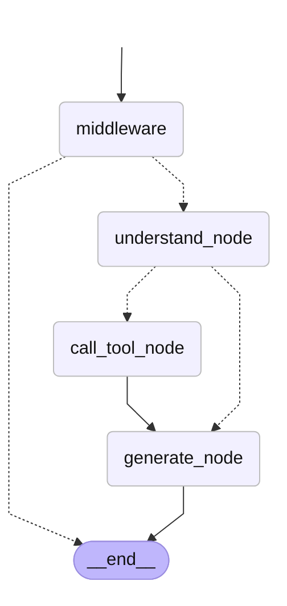

# CBNU Agent

충북대학교 관련 정보(기숙사 식단, 학과 공지, 학교 공지, 학사일정 등)를 한 곳에서 물어볼 수 있는 간단한 AI 챗봇 에이전트입니다.

## 1. 서비스 소개 및 사용 시나리오

"충북대 학생이 하루에 여러 사이트를 돌아다니지 않고도 한 곳에서 정보를 물어보는 챗봇"을 목표로 합니다.

### 대표 사용 예시

- **기숙사 식단 질문**
  - 사용자: "오늘 양성재 점심 메뉴 뭐야?"
  - 에이전트: 미리 수집한 기숙사 식단 데이터를 RAG로 검색해 답변합니다.

- **학사/학과 공지 질문**
  - 사용자: "소프트웨어학부 최근 공지사항들 알려줘"
  - 에이전트: 미리 수집한 공지사항 데이터에서 검색해서 답변하며, 참고한 공지의 제목·날짜·URL을 함께 보여줍니다.

- **후속 대화**
  - 사용자: "방금 공지 중 첫번째 공지에 대해 자세히 알려줘"
  - 에이전트: 대화 메모리를 활용해 이전 검색 결과를 기반으로 추가 설명합니다.

- **학사일정 질문**
  - 사용자: "2학기 개강 날짜가 어떻게 돼?"
  - 에이전트: 미리 수집한 학사일정 데이터에서 검색해 개강일과 관련 일정을 답변합니다.

## 2. 전체 아키텍처 설명

LangGraph 기반의 `StateGraph`로 동작하며, `MemorySaver`를 사용해 대화 맥락을 유지합니다.
입력은 `middleware`에서 검증되고, 질문 유형에 따라 `search_notices` 도구를 호출하거나 바로 답변을 생성합니다.

```
사용자 입력
    ↓
middleware (입력 검증 + 로깅)
    ↓
understand_node (도구 호출/일반 대화 판단)
    ↓ (조건 분기)
call_tool_node ────────→ generate_node
    ↓                        ↓
search_notices            최종 답변 생성
(공지 + 식단 + 학사일정 통합 검색)
```



### 노드 설명

| 노드 | 역할 |
|------|------|
| `middleware` | 사용자 입력을 검증하고, 실행 로그를 남깁니다. |
| `understand_node` | 사용자 질문을 이해해 필요한 도구를 선택하거나 일반 대화에 바로 답변합니다. |
| `call_tool_node` | 선택된 도구(`search_notices`)를 실행합니다. |
| `generate_node` | 도구 결과와 대화 기록을 바탕으로 최종 답변을 생성합니다. |

분기(점선 화살표)는 조건 엣지(conditional edge)로, middleware에서 입력이 유효하지 않으면 바로 종료하고, understand_node에서 도구 호출이 필요한 경우에만 `call_tool_node`로 이동합니다.

## 3. 설치 및 실행 방법

### 1) 의존성 설치

```bash
pip install -r requirements.txt
```

### 2) 환경 변수 설정

`.env.example`을 참고해 `.env` 파일을 만들고 OpenAI API 키를 입력합니다.

```bash
cp .env.example .env
# .env 파일을 열어 OPENAI_API_KEY를 입력합니다.
```

```env
OPENAI_API_KEY=sk-xxxxxxxxxxxxxxxxxxxxxxxxxxxxxxxx
```

### 3) 공지사항 및 식단 데이터 수집

서버 시작 전에 최신 공지사항, 기숙사 식단, 학사일정 데이터를 수집합니다.

```bash
python -m src.crawlers.run_all
```

`run_all.py`를 실행하면 `data/raw/notices/`, `data/raw/dorm_menu/`, `data/raw/academic_calendar/`에 텍스트 파일이 저장되고, 벡터스토어가 최신 데이터로 갱신됩니다.

### 4) 웹 서버 실행

```bash
uvicorn server:app --reload
```

브라우저에서 http://localhost:8000 에 접속하면 웹 UI를 통해 챗봇을 사용할 수 있습니다.

> 참고: `server.py`는 FastAPI 앱(`app`)을 노출하며 `/api/chat` 엔드포인트를 제공합니다.

## 4. 사용된 주요 기술

### Tool

- `search_notices(query: str)`: 미리 구축한 Chroma 벡터스토어에서 사용자 질문과 관련된 공지사항 및 기숙사 식단 내용을 검색합니다.
  - 출처 키워드("기숙사"/"생활관", "전자정보", "소프트웨어", "학교"/"학사", "학사일정"/"개강"/"수강신청")가 포함되면 해당 소스를 우선 검색합니다.
  - 날짜 키워드("오늘", "어제", "내일", "이번 주", "다음 주")는 KST 기준 절대 날짜로 변환되어 검색에 활용됩니다.
  - 식단/메뉴 키워드("메뉴", "식단", "아침", "점심", "저녁", "밥")가 포함되면 기숙사 식단 문서를 우선 검색합니다.
  - "최근"/"최신" 키워드가 포함되면 해당 소스의 공지를 날짜 기준 내림차순으로 정렬해 반환합니다.
  - "자세히"/"상세히" 키워드가 포함되면 같은 공지의 여러 chunk를 함께 반환해 상세한 답변을 가능하게 합니다.
  - 검색 결과에는 공지 제목·날짜·URL, 기숙사·날짜·URL, 학사일정 제목·일정(날짜) 메타데이터가 포함되어 답변에 출처로 노출됩니다.

### RAG

- `data/raw/notices/`, `data/raw/dorm_menu/`, `data/raw/academic_calendar/`에 있는 텍스트 파일들을 `DirectoryLoader`로 읽고, `RecursiveCharacterTextSplitter`로 분할합니다.
- 각 공지 문서의 제목, 날짜, URL과 각 식단 문서의 기숙사, 날짜, URL, 각 학사일정의 제목, 일정(날짜)을 chunk 앞에 추가해 검색 결과에 출처 정보를 담습니다.
- PDF 첨부파일이 있는 공지는 `src/crawlers/notice_crawler.py`에서 PDF 텍스트를 추출해 본문에 포함시킵니다.
- `OpenAIEmbeddings`로 임베딩한 뒤 `Chroma` 벡터스토어에 저장합니다.
- Chroma 벡터스토어는 `chroma_db/` 디렉터리에 영속화되며, 크롤링을 실행할 때만 `force_rebuild=True`로 갱신됩니다.
- 질문이 들어오면 `retriever.invoke(query)`로 유사도 기반 문서를 검색해 답변에 활용합니다.

### Memory

- `langgraph.checkpoint.memory.MemorySaver`를 사용해 스레드별 대화 이력을 유지합니다.
- 이전 대화 맥락을 바탕으로 후속 질문에 자연스럽게 답변할 수 있습니다.

### Middleware

- `middleware_node`는 사용자 입력이 비어 있거나 1000자를 초과하는지 검증합니다.
- 유효하지 않은 입력은 바로 안내 메시지를 반환하고 워크플로우를 종료합니다.
- `log_middleware`에서는 최신 사용자 메시지와 메시지 개수를 로깅합니다.

### OutputParser

- `FinalAnswer` Pydantic 모델을 정의해 최종 답변을 `answer`, `sources` 필드로 구조화합니다.
- `generate_node`에서 LLM 출력을 파싱해 깔끔한 답변을 생성하고, 참고한 공지 URL을 `sources`에 담아 API 응답에 함께 전달합니다.
- 최종 답변에 실제로 인용된 URL만 `sources`로 유지합니다.

## 5. 한계점 및 향후 개선 방향

### 한계점

- **실시간 데이터 의존**: 공지사항, 기숙사 식단, 학사일정은 주기적 크롤링 이후에 검색할 수 있어 최신 정보가 바로 반영되지 않을 수 있습니다.
- **크롤링 불안정성**: 웹사이트 구조가 변경되면 CSS 선택자를 직접 수정해야 합니다.
- **이미지 파일 읽기**: 공지의 본문에 첨부파일도 없고 오로지 이미지로만 구성된 경우 현재 이를 데이터로 저장할 수 없습니다.
- **크롤링 범위**: 크롤링 하는 범위가 아직 제한적이고 가져오는 공지 페이지의 개수도 제한해두었기에 실제 공지사항에 있는 내용이지만 크롤링 범위 밖에 있어(상위 50개 밖) 가져오지 못할 수 있습니다. ex)소프트웨어학부 등록금을 물어봤는데 등록금 관련 공지 상위 공지가 이미 50개 이상 쌓여 있어 데이터에 포함이 안 됨
- **소스 선택 판단**: 검색하려는 소스(긱사, 단과대 등등)를 결정할 때 현재는 키워드 중심으로 하드필터링을 1차적으로 하고 그 결과가 없을때 전체 소스를 검색하고 있습니다. 

### 향후 개선 방향

- **자동 크롤링 스케줄러**: 스케줄러 등으로 주기적으로 공지사항을 수집하도록 자동화합니다.
- **더 많은 데이터 소스**: 학생회, 장학 공지, 도서관 등 추가 정보를 확장하고 최대로 크롤링 할 수 있는 공지 개수도 늘립니다.
- **본문 전처리 강화**: 학교 메인 공지의 상단 메뉴/네비게이션 텍스트를 제거하는 전처리 로직을 개선합니다.
- **소스 검색 판단 강화**: llm이 어떤 소스를 검색해야할지 판단하는 미들웨어를 추가하여 기존 로직(하드 필터링)과 적절히 혼합합니다.
- **컨텍스트 요약**: 컨텍스트 요약 미들웨어를 추가해 대화 품질을 개선합니다.
