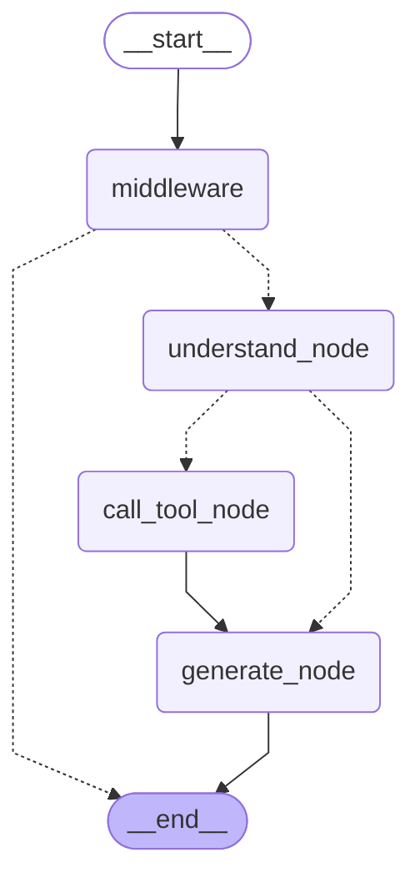

# CBNU Agent LangGraph Workflow Diagram

이 문서는 `server.py`에 정의된 LangGraph 워크플로우를 Mermaid 다이어그램으로 표현한 것입니다.

## 노드 설명

| 노드 | 역할 |
|------|------|
| `middleware` | 사용자 입력을 검증하고, 실행 로그를 남깁니다. |
| `understand_node` | 사용자 질문을 이해해 필요한 도구를 선택하거나 일반 대화에 바로 답변합니다. |
| `call_tool_node` | 선택된 도구(`get_dorm_menu`, `search_notices`)를 실행합니다. |
| `generate_node` | 도구 결과와 대화 기록을 바탕으로 최종 답변을 생성합니다. |

분기(점선 화살표)는 조걶 엣지(conditional edge)로, middleware에서 입력이 유효하지 않으면 바로 종료하고, understand_node에서 도구 호출이 필요한 경우에만 `call_tool_node`로 이동합니다.
